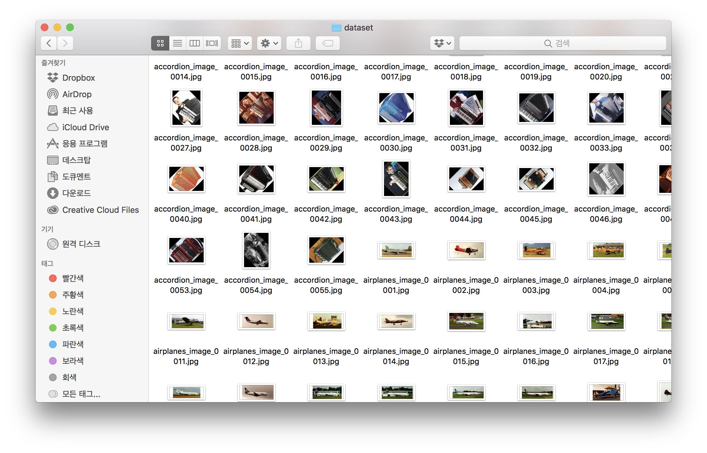

<h1 align="center">sally</h1>

<p align="center">
    <a href="https://www.codefactor.io/repository/github/kennethanceyer/sally"></a>
    <a href="https://codebeat.co/projects/github-com-kennethanceyer-sally-master"></a>
    <a href="https://codeclimate.com/github/KennethanCeyer/sally/maintainability"></a>
    <a href="https://codeclimate.com/github/KennethanCeyer/sally/test_coverage"></a>
    <a href="https://github.com/KennethanCeyer/sally/blob/master/LICENSE"></a>
</p>

<p align="center">dataset management tool for object detection</p>

[](https://asciinema.org/a/187717)

## Overview

sally can helps you to download dataset very easily



## Installation

sally is still working in progress project, You only can get an experience to use demo as follows

```bash
$ git clone git@github.com:KennethanCeyer/sally.git
$ cd sally
```

```bash
$ pip install -g pipenv
$ pipenv install
$ pipenv shell
$ export PYTHON_PATH=$PYTHON_PATH:$(pwd)
```

## Usage

sally install command helps to download labeled image dataset to your local disk


- cli style
```bash
$ python -m sally install
```

- code style
```python
from sally import DataSet
dataset = DataSet(repository='{repository name}')
dataset.download()
```

### Commands

name | option | description | example | note
-----|--------|-------------|---------|----------
install | - | install dataset from repository | `$ sally install` | -
add | - | adding a repository | `$ sally add {repository} {url}` | `$ sally add coco http://images.cocodataset.org/zips/val2017.zip` | TBA
remove | - | removing a repository | `$ sally delete {repository}` | `$ sally remove coco` | TBA
set | - | setting a repository | `$ sally set {repository} {url}` | `$ sally add coco http://images.cocodataset.org/zips/val2017.zip` | TBA
list | - | show list of repositories | `$ sally list` | `$ sally list` | TBA

### Repositories

name | url | images
-----|-----|---------
caltech | http://www.vision.caltech.edu/Image_Datasets/Caltech101/101_ObjectCategories.tar.gz | 9145


## License

sally is under MIT license

MIT License

Copyright (c) 2018 PIGNOSE

Permission is hereby granted, free of charge, to any person obtaining a copy
of this software and associated documentation files (the "Software"), to deal
in the Software without restriction, including without limitation the rights
to use, copy, modify, merge, publish, distribute, sublicense, and/or sell
copies of the Software, and to permit persons to whom the Software is
furnished to do so, subject to the following conditions:

The above copyright notice and this permission notice shall be included in all
copies or substantial portions of the Software.

THE SOFTWARE IS PROVIDED "AS IS", WITHOUT WARRANTY OF ANY KIND, EXPRESS OR
IMPLIED, INCLUDING BUT NOT LIMITED TO THE WARRANTIES OF MERCHANTABILITY,
FITNESS FOR A PARTICULAR PURPOSE AND NONINFRINGEMENT. IN NO EVENT SHALL THE
AUTHORS OR COPYRIGHT HOLDERS BE LIABLE FOR ANY CLAIM, DAMAGES OR OTHER
LIABILITY, WHETHER IN AN ACTION OF CONTRACT, TORT OR OTHERWISE, ARISING FROM,
OUT OF OR IN CONNECTION WITH THE SOFTWARE OR THE USE OR OTHER DEALINGS IN THE
SOFTWARE.
